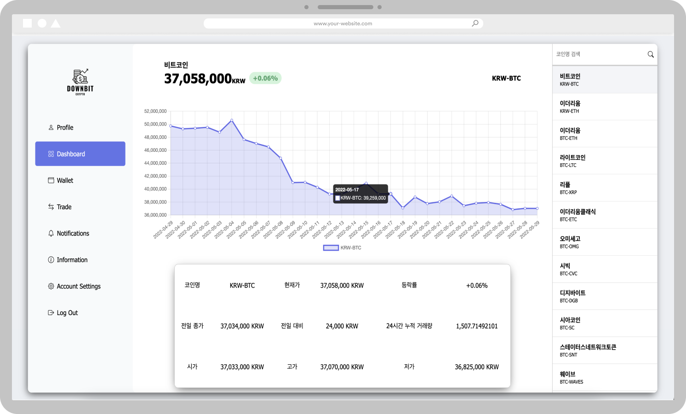

    </a>&nbsp
    </a>&nbsp
    </a>&nbsp
    </a>&nbsp
    </a>&nbsp
    </a>&nbsp

***
### 업비트 WebSocket과 API를 이용한 실시간 코인 시세 조회 서비스
#### 원활한 시세를 조회하기 위해 WebSocket을 이용헤 실시간으로 반영
***

- ### 메인 페이지1

- ### 메인 페이지 2

- ### 대시보드

*** 
- ## [디자인 참고](https://dribbble.com/shots/18056643-Crypto-Dashboard)
***
- ## 느낀점 😎
### 처음으로 웹소켓을 사용해봤는데 어느 언어로 요청할지 고민을 많이 했고 가져온 정보를 어떻게 뿌릴지도 많은 고민을 한 것같다. 
### 순수 html과 js만 사용해서 쉽게 호스팅을 하는 것이 목표였는데 이루어서 뿌듯하다!